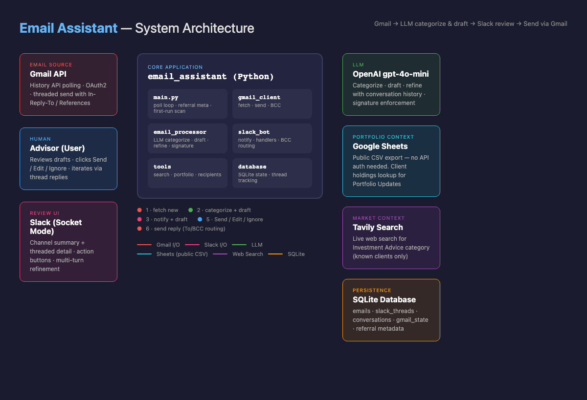

# Email Assistant - Gmail to Slack AI Agent

An intelligent email assistant that connects Gmail to Slack, categorizing incoming emails and generating suggested replies using AI. Built for busy investment advisers who want to stay focused in one application.

## Overview

This system:
1. **Polls Gmail** for new emails (never misses any with Gmail History API tracking)
2. **Categorizes** each email into: Portfolio Updates, Investment Advice, Referrals, or Other
3. **Generates** AI-powered suggested replies using context (portfolio data, web search)
4. **Sends to Slack** — compact summary in channel, full details + action buttons in thread
5. **Handles feedback** through Slack threads where users can request modifications
6. **Sends replies** back via Gmail when approved
7. **Smart referral routing** — first reply BCC's the referrer and addresses the referred person; follow-ups drop the referrer entirely

## Architecture



```
┌──────────────────────────────────────────────────────────────┐
│                    Email Assistant                            │
├──────────────────────────────────────────────────────────────┤
│                                                              │
│  Gmail API ──> [Email Processor] ──> Slack Bot               │
│   (History     • Categorize        • Notify user             │
│    API)        • Generate reply    • Handle actions           │
│                • Referral routing  • Thread mgmt              │
│                • Call tools        • BCC routing              │
│                                                              │
│  Tools:                                                      │
│  • Google Sheets (portfolio lookup — public CSV, no auth)    │
│  • Tavily Web Search (investment research)                   │
│  • OpenAI LLM (categorization & reply generation)            │
│                                                              │
│  Storage:                                                    │
│  • SQLite (processed emails, thread mapping, history)        │
│                                                              │
└──────────────────────────────────────────────────────────────┘
```

## Features

### Email Categorization
- **Portfolio Updates**: Portfolio performance, rebalancing, account updates
- **Investment Advice**: Questions about stocks, funds, asset allocation
- **Referrals**: New client introductions with courteous responses
- **Other**: General inquiries with best-effort responses

### Smart Context
- **Portfolio Updates**: Fetch relevant portfolio data from Google Sheets (public CSV — no Google Cloud auth needed)
- **Investment Advice**: Run Tavily web searches for current market data; known clients get research-backed advice, non-clients get a polite decline with a call invitation
- **Referrals**: Detect referrer vs referred person(s) from To/CC; first reply thanks referrer (BCC'd) and welcomes referred; follow-ups address only the referred person
- **Non-client awareness**: Context-aware identity handling — only asks for verification on client-sensitive requests, not general inquiries or referral threads

### User Interaction
- Compact summary in Slack channel, full details in thread
- One-click actions: Send, Edit, Ignore
- Thread-based feedback system for reply modifications
- Full conversation history maintained for multi-turn refinement

### Reliability
- Gmail History API for incremental sync (never misses emails)
- Database-backed state tracking with idempotent processing
- Automatic fallback to full sync if history ID expires

## How It Works

For a detailed look at the system internals — Gmail reliability guarantees, email processing pipeline, Slack interaction flow, and more — see **[docs/HOW_IT_WORKS.md](docs/HOW_IT_WORKS.md)**.

## Prerequisites

- **Python 3.9+**
- **Google Account** with Gmail API enabled
- **Google Cloud Project** with Gmail API (Sheets uses public CSV export — no Sheets API needed)
- **Slack Workspace** with a Slack App (Socket Mode)
- **OpenAI API Key** (for LLM)
- **Tavily API Key** (optional, for web search on Investment Advice emails)

## Setup

### 1. Clone & Install

```bash
git clone <repo-url>
cd email-assistant

python3 -m venv venv
source venv/bin/activate

pip install -r requirements.txt
```

### 2. Google Cloud Setup

1. Go to [Google Cloud Console](https://console.cloud.google.com/)
2. Create a new project or select existing
3. Enable the **Gmail API** (Google Sheets API is **not** needed — portfolio data is read from a public sheet via CSV export)
4. Configure OAuth consent screen:
   - Set to **External** (or Internal if using Google Workspace)
   - Add your email as a **test user**
5. Create OAuth 2.0 credentials:
   - Go to "Credentials" > "Create Credentials" > "OAuth client ID"
   - Choose "Desktop application"
   - Download JSON file as `credentials.json` in the project root
6. Set up a **public** Google Sheet for portfolio data:
   - Sample sheet: https://docs.google.com/spreadsheets/d/1iboWR0CpWKRvzsw8wTIjeYo4UStzH9I1IzDZPWFCwUk/edit
   - Columns: Name | Email | Portfolio Holdings | Current Net Worth | Expected Next Quarter Earnings | Has Beneficiary | Beneficiary Name
   - Make sure the sheet is set to **"Anyone with the link can view"**
   - Copy the Sheet ID from the URL

### 3. Slack App Setup

1. Go to [Slack App Dashboard](https://api.slack.com/apps)
2. Create a new app (From scratch)
3. **Enable Socket Mode**:
   - Go to "Socket Mode" > Toggle ON
   - Create an App-Level Token with `connections:write` scope
   - Copy the token (starts with `xapp-`)
4. **Add bot permissions** (OAuth & Permissions > Scopes):
   - `chat:write` — Send messages
   - `channels:history` — Read channel history
   - `groups:history` — Read private channel history
5. **Enable Event Subscriptions**:
   - Toggle ON
   - Subscribe to bot events: `message.channels`, `message.groups`
6. **Enable Interactivity & Shortcuts**:
   - Toggle ON (no Request URL needed with Socket Mode)
7. **Install app** to workspace
8. Copy the **Bot Token** (`xoxb-...`) and **Signing Secret**

### 4. Create Private Slack Channel

1. Create a private channel (e.g., `#email-assistant`)
2. Add your bot to the channel (`/invite @YourBotName`)
3. Get the Channel ID: right-click channel name > "View channel details" > copy the ID at the bottom

### 5. Environment Setup

```bash
cp .env.example .env
```

Edit `.env` with your credentials:

```
OPENAI_API_KEY=sk-proj-...
SLACK_BOT_TOKEN=xoxb-...
SLACK_SIGNING_SECRET=...
SLACK_APP_TOKEN=xapp-...
SLACK_CHANNEL_ID=C...
GOOGLE_SHEET_ID=...
TAVILY_API_KEY=...          # optional
```

### 6. First Run (Google OAuth)

```bash
python3 -m src.main
```

A browser window will open for Google OAuth. Authorize the app. Tokens are saved to `token.json` for future runs.

## Running

```bash
# Activate virtualenv
source venv/bin/activate

# Run the assistant
python3 -m src.main

# Stop with Ctrl+C
```

The assistant will:
- Start the Slack bot (Socket Mode) for interactive features
- Begin polling Gmail for new emails every 30 seconds
- Post email summaries to your Slack channel with details in threads

## Testing

```bash
# Run all tests
python3 -m pytest tests/ -v

# Run with coverage
python3 -m pytest --cov=src tests/

# Run specific test file
python3 -m pytest tests/test_slack_bot.py -v
```

See [`docs/TESTING.md`](docs/TESTING.md) for details on the test layout, fixtures, mocking conventions, and how to add new tests.

## Configuration

### Environment Variables

| Variable | Required | Description |
|----------|----------|-------------|
| `OPENAI_API_KEY` | Yes | OpenAI API key for LLM |
| `SLACK_BOT_TOKEN` | Yes | Slack bot token (`xoxb-...`) |
| `SLACK_SIGNING_SECRET` | Yes | Slack app signing secret |
| `SLACK_APP_TOKEN` | Yes | Slack app-level token for Socket Mode (`xapp-...`) |
| `SLACK_CHANNEL_ID` | Yes | Slack channel ID for notifications |
| `GOOGLE_CREDENTIALS_PATH` | No | Path to credentials.json (default: `./credentials.json`) |
| `GOOGLE_TOKEN_PATH` | No | Path to store token.json (default: `./token.json`) |
| `GOOGLE_SHEET_ID` | Yes | Google Sheet ID for portfolios |
| `TAVILY_API_KEY` | No | Tavily API key for web search |
| `POLL_INTERVAL` | No | Email poll interval in seconds (default: 30) |
| `DB_PATH` | No | SQLite database path (default: `email_assistant.db`) |

## Security Considerations

### OAuth2 & Credentials
- Uses OAuth2 with minimal required scopes
- Token files written with restricted permissions (`0o600`)
- Tokens auto-refreshed when expired
- Credentials never committed to git (`.gitignore`)
- Production: Use secure key management (AWS Secrets Manager, HashiCorp Vault)

### Data Privacy
- Private Slack channel ensures email privacy
- Socket Mode — no public URL exposed
- Production: Encrypt SQLite database at rest (e.g., `sqlcipher`)

### Input Validation
- LLM prompts sanitized via `sanitize_for_prompt()` before sending
- XML delimiters around user content to mitigate prompt injection
- Email body base64 decoding handles malformed data gracefully
- Production: Rate limit API calls to prevent abuse

## Project Structure

```
email-assistant/
├── src/
│   ├── main.py                 # Orchestrator (polling + Slack server)
│   ├── config.py               # Configuration from .env
│   ├── database.py             # SQLite models & queries
│   ├── gmail_client.py         # Gmail API (History API, send, mark read)
│   ├── sheets_client.py        # Google Sheets API (portfolio lookup)
│   ├── email_processor.py      # LLM categorization & reply generation
│   ├── slack_bot.py            # Slack Bot (Socket Mode, actions, threads)
│   ├── tools.py                # Web search, portfolio lookup
│   └── utils.py                # Sanitization helpers
├── tests/
│   ├── conftest.py              # Pytest fixtures
│   ├── test_config.py           # Config validation tests
│   ├── test_database.py         # Database tests
│   ├── test_email_processing.py # Email context, referral metadata, signatures
│   ├── test_email_processor.py  # LLM categorization & reply tests
│   ├── test_gmail_client.py     # Gmail client tests
│   ├── test_referral_routing.py # Referral BCC routing & DB thread tracking
│   ├── test_slack_bot.py        # Slack bot tests
│   └── test_tools.py           # Tools tests
├── docs/
│   ├── HOW_IT_WORKS.md          # Detailed system internals documentation
│   └── TESTING.md               # Test suite guide and conventions
├── requirements.txt            # Python dependencies
├── .env.example                # Environment template
├── .gitignore                  # Git ignore rules
└── README.md                   # This file
```

## Troubleshooting

### "Access blocked" during Google OAuth
Your Google Cloud project is in testing mode. Go to **APIs & Services > OAuth consent screen > Test users** and add your email.

### Gmail OAuth Token Expired
```
Error: oauth2: "invalid_grant" "Token has been expired or revoked"
```
**Fix**: Delete `token.json` and restart. Browser will open for re-authentication.

### Slack Buttons Not Working
- Ensure **Socket Mode** is enabled in your Slack app settings
- Ensure `SLACK_APP_TOKEN` is set in `.env` (starts with `xapp-`)
- Ensure **Interactivity & Shortcuts** is toggled ON
- Check logs for "Starting Slack bot (Socket Mode)..."

### Slack Bot Not Responding to Messages
- Ensure **Event Subscriptions** is enabled
- Subscribe to `message.groups` (for private channels) or `message.channels`
- Reinstall the app if you added new scopes

### Google Sheets Not Loading
- Verify `GOOGLE_SHEET_ID` is correct
- Verify the sheet is set to **"Anyone with the link can view"** (public access required — no Google Sheets API auth is used)
- Check sheet has headers in the first row

## Production Improvements

- [ ] Gmail Push Notifications (Pub/Sub) instead of polling
- [ ] PostgreSQL instead of SQLite
- [ ] Message queue (Celery/Redis) for async processing
- [ ] Database encryption at rest (sqlcipher)
- [ ] Secrets management (AWS Secrets Manager)
- [ ] Structured logging and monitoring
- [ ] CI/CD pipeline (GitHub Actions)
- [ ] Rate limiting and exponential backoff

---

**Built for interview assignment** — Investment Adviser Email Assistant | OpenAI + Google Cloud + Slack
