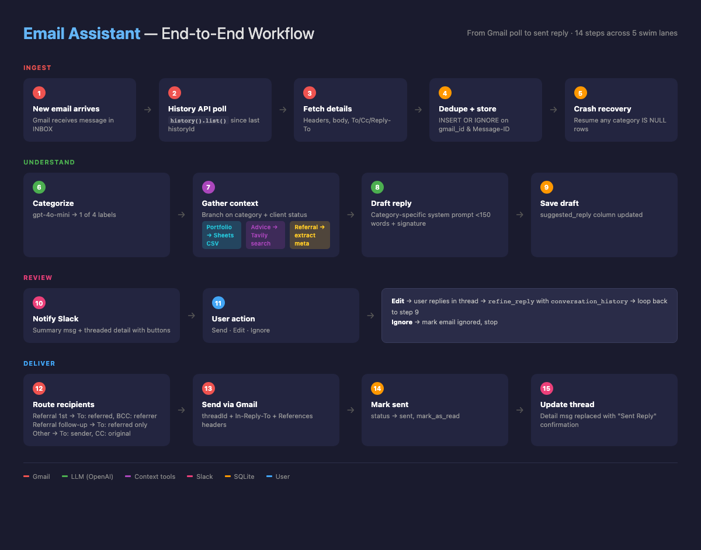

# How It Works

A detailed look at how the Email Assistant works behind the scenes — from Gmail polling to Slack interaction to sending replies.



## Table of Contents

- [Lifecycle of an Email](#lifecycle-of-an-email)
- [Gmail Integration & Reliability](#gmail-integration--reliability)
- [Email Categorization & Reply Generation](#email-categorization--reply-generation)
- [Referral Workflow & BCC Routing](#referral-workflow--bcc-routing)
- [Slack Interaction Flow](#slack-interaction-flow)
- [Sending Replies](#sending-replies)
- [Database & State Management](#database--state-management)
- [Security](#security)

---

## Lifecycle of an Email

Here's what happens end-to-end when a new email arrives:

```
1. Gmail receives new email
2. Polling loop detects it via History API
3. Email details are fetched (headers, body, recipients)
4. Deduplicated by RFC Message-ID (prevents duplicates)
5. Stored in SQLite database
6. LLM categorizes it (Portfolio Updates / Investment Advice / Referrals / Other)
7. Context is gathered based on category:
   - Portfolio Updates → Google Sheets portfolio lookup (public CSV export, no auth)
   - Investment Advice → Tavily web search for market data (known clients only)
   - Referrals → referrer/referred extraction from To/CC, BCC routing metadata
8. LLM generates a suggested reply using the context and category-specific system prompt
9. Slack receives:
   - Channel message: compact summary (sender, date, subject, category)
   - Thread reply: full email body + suggested reply + action buttons
10. User reviews and clicks Send, Edit, or Ignore
11. If Send → reply is sent via Gmail as a proper threaded reply
12. The detail message in Slack is updated to show "Sent Reply"
```

---

## Gmail Integration & Reliability

### Why History API Instead of Polling for Unread?

A naive approach would be to poll Gmail for `is:inbox is:unread` emails. The problem: if a user reads an email on their phone before the assistant processes it, the email is marked as read and the assistant never sees it.

The Gmail History API solves this. It tracks **all changes** to the mailbox, not just unread status. It works like a changelog:

1. Gmail assigns a `historyId` to every state change
2. We store the last seen `historyId` in the database
3. Each poll asks: "What messages were added to the inbox since this `historyId`?"
4. Gmail returns all new message IDs, regardless of read/unread status

### First Run Behavior

On the very first run, the assistant needs to establish a baseline for the History API **without** flooding Slack with your entire inbox. It:

1. Calls `users().getProfile()` to get the current `historyId`
2. Saves it to the database as the starting point for future incremental syncs
3. Fetches up to 20 recent unread inbox emails and processes them — this ensures emails that arrived just before startup aren't missed
4. From this point forward, only new emails (detected via History API) are processed

### Never Missing an Email

Three mechanisms ensure no email is ever lost:

**1. History API Tracking**
Every poll uses `users().history().list()` with `historyTypes=messageAdded` and `labelId=INBOX`. This catches every email added to the inbox, even if it was immediately read or archived elsewhere.

**2. Idempotent Processing**
Each email is inserted into the database with `INSERT OR IGNORE` on a unique Gmail ID. If the same email appears twice (e.g., from overlapping history windows), it's silently skipped.

**3. Crash Recovery**
On startup, the assistant checks for any emails that were fetched into the database but never fully processed (inserted but no category assigned). These are retried before the normal polling loop begins. This handles cases where:
- The app crashed mid-processing
- An API call (OpenAI, Slack) failed for one email in a batch
- The app was stopped between fetching and processing

### History ID Expiration

Gmail only keeps history for about 7 days. If the app is offline for longer, the history ID becomes invalid (HTTP 404). When this happens, the assistant resets to the current point — any emails from the gap that were already fetched will be caught by crash recovery on the next startup.

### Duplicate Prevention

The same physical email can sometimes appear with different Gmail internal IDs (e.g., when labels change). To prevent duplicate Slack notifications, emails are deduplicated by their RFC `Message-ID` header — a globally unique identifier assigned by the sending mail server.

---

## Email Categorization & Reply Generation

### Categorization

Each email is categorized by sending it to OpenAI's `gpt-4o-mini` with a zero-temperature prompt. The model returns exactly one of four categories:

| Category | Trigger | Example |
|----------|---------|---------|
| **Portfolio Updates** | Portfolio performance, rebalancing, account changes | "Your Q1 portfolio returned 8.2%" |
| **Investment Advice** | Questions about stocks, funds, allocation | "Should I increase my tech exposure?" |
| **Referrals** | Client introductions, CC'd recipients | "Meet my colleague John who needs..." |
| **Other** | Everything else | "Can we reschedule our meeting?" |

If the model returns an unexpected value, it defaults to "Other".

### Client Detection

Before categorization, the assistant looks up the sender's email address in the Google Sheet (fetched as a public CSV — no Google Sheets API or Google Cloud auth required). If a match is found, the sender is treated as a **known client** and their portfolio data is available for context. This affects how replies are generated across all categories.

### Context Gathering

Before generating a reply, the assistant gathers relevant context based on the category and client status:

- **Portfolio Updates** (known client): Looks up their portfolio in the Google Sheet (holdings, net worth, expected earnings, beneficiary info) and includes it in the LLM prompt
- **Investment Advice** (known client): Extracts investment keywords from the email body and runs a Tavily web search for current market data. The assistant responds as the client's financial advisor with direct, research-backed guidance
- **Investment Advice** (non-client): Does **not** run a web search. Instead, politely explains that advice is only for existing clients, asks about their portfolio size, and offers to schedule a call to discuss becoming a client
- **Referrals**: Identifies the referrer (sender) and referred person(s) (everyone in To/CC except the sender and the assistant's own email). Builds referral metadata that controls both the LLM prompt and the recipient routing at send time
- **Non-client, general**: The reply is generated naturally without automatically asking the sender to verify their identity — verification is only prompted when the sender asks about client-sensitive information (account details, specific portfolio data)

### Reply Generation

The reply is generated with a category-specific system prompt that sets the tone:
- **Portfolio Updates**: formal, acknowledges information, offers insights
- **Investment Advice**: "You ARE the client's financial advisor" — gives direct, actionable advice with risk caveats. Does **not** tell the client to "consult a financial advisor" since that's the assistant's role
- **Referrals**: warm, follows specific first-reply vs follow-up instructions (see [Referral Workflow](#referral-workflow--bcc-routing))
- **Other**: helpful and professional

The model receives the full email content, any gathered context, and generates a reply under 150 words. Every reply:
- Ends with a consistent signature: **Sarah James, Investment Adviser, HSBC**
- Does **not** include a `Subject:` line in the body (the LLM is explicitly instructed to omit it)

### Reply Refinement

When a user clicks "Edit" and provides feedback in the Slack thread, the assistant refines the reply. It sends the full conversation history (all previous feedback and revisions) to the LLM so it understands the multi-turn context. This allows iterative refinement:

```
User: "Make it more formal"
→ Assistant generates formal version
User: "Add a mention of the Q1 report"
→ Assistant adds Q1 reference while keeping the formal tone
```

---

## Referral Workflow & BCC Routing

Referral emails require special handling — the referrer (existing client) introduces a new person, and the reply needs to address both parties differently depending on where we are in the conversation.

### Metadata Extraction

When an email is categorized as "Referrals", the assistant builds referral metadata:

1. **Referrer** = the email sender (existing client who made the introduction)
2. **Referred person(s)** = everyone in To/CC except the referrer and the assistant's own email
3. **Is first reply?** = checks `has_sent_reply_in_thread()` in the database — `True` if no reply has been sent in this Gmail thread yet

This metadata is persisted in `recipients_json` so it's available at send time.

### First Reply (New Referral Thread)

When the user clicks Send on the first reply in a referral thread:

```
To:  referred person(s)     ← the new prospective client(s)
BCC: referrer               ← existing client, kept informed but removed from thread
CC:  (empty)
```

The LLM reply is structured in this order:
1. Briefly thank the referrer for the introduction and mention they're being moved to BCC
2. Address the referred person(s) directly
3. Express interest in learning about their investment needs
4. Invite **them** (not the referrer) to schedule a call

### Follow-Up Replies (Same Thread)

Once the first reply has been sent, any subsequent replies in the same thread:

```
To:  referred person(s)
BCC: (empty)                ← referrer fully dropped
CC:  (empty)
```

The LLM prompt instructs to address only the referred person — no mention of the referrer or BCC.

### Non-Referral Emails

Standard emails reply to the original sender (or `Reply-To` if present) with the original CC preserved and BCC empty.

---

## Slack Interaction Flow

### Message Structure

Each email creates two Slack messages:

1. **Channel message** (top-level): A compact summary card showing sender, date, subject, and category. This keeps the channel scannable.

2. **Thread reply**: The full email body, suggested reply in a code block, and three action buttons (Send, Edit, Ignore). This keeps details contained within a thread.

### Action Buttons

| Button | What Happens |
|--------|-------------|
| **Send** | Sends the suggested reply via Gmail as a threaded reply. The detail message in Slack is replaced with a "Sent Reply" confirmation showing exactly what was sent. |
| **Edit** | Posts a prompt in the thread asking for feedback. The user replies with what they want changed, and the assistant generates a refined version. |
| **Ignore** | Marks the email as ignored in the database. A confirmation is posted in the thread. |

### Socket Mode

The Slack bot uses Socket Mode (WebSocket connection) rather than HTTP webhooks. This means:
- No public URL or ngrok needed
- The bot connects outbound to Slack's servers
- Button clicks and messages are received instantly over the WebSocket
- Works behind firewalls and NATs

---

## Sending Replies

### Proper Email Threading

When you click "Send", the reply is sent as a **threaded reply** to the original email, not as a new email. This is done by setting three things:

1. **`threadId`**: Gmail's internal thread identifier, passed in the API call body
2. **`In-Reply-To`**: Set to the original email's RFC `Message-ID` header
3. **`References`**: Also set to the original email's RFC `Message-ID` header

These headers tell the recipient's email client that this is a reply to a specific message, so it appears in the same conversation thread.

### Recipient Routing

The `_on_send_email` handler in the Slack bot determines recipients based on the email category and `recipients_json`:

| Category | To | CC | BCC |
|----------|----|----|-----|
| **Referrals (first reply)** | Referred person(s) | Empty | Referrer |
| **Referrals (follow-up)** | Referred person(s) | Empty | Empty |
| **Other categories** | Sender (or Reply-To) | Original CC | Empty |

The Gmail client's `send_reply()` method accepts `to`, `cc`, and `bcc` parameters and sets the appropriate MIME headers.

---

## Database & State Management

### SQLite Schema

The assistant uses SQLite with four tables:

| Table | Purpose |
|-------|---------|
| `emails` | Every email fetched from Gmail — ID, headers, body, category, suggested/final reply, status |
| `slack_threads` | Maps each email to its Slack thread timestamp and detail message timestamp |
| `conversations` | Stores all messages in Slack threads for multi-turn refinement context |
| `gmail_state` | Tracks the last Gmail `historyId` for incremental sync |

### Idempotency

- Email inserts use `INSERT OR IGNORE` with a unique constraint on `gmail_id`
- Additional deduplication on `rfc_message_id` before processing
- The `category IS NULL` check prevents reprocessing already-categorized emails
- These together mean the system can safely re-encounter the same email without duplicating work

### State Transitions

Each email moves through these statuses:

```
pending → (categorized, reply generated, sent to Slack)
       → sent     (user clicked Send)
       → ignored  (user clicked Ignore)
```

---

## Security

### Prompt Injection Mitigation

All user-provided content (email subject, body, sender) is:
1. **Sanitized** via `sanitize_for_prompt()` — strips control characters and truncates to safe lengths
2. **Wrapped in XML delimiters** (`<email>...</email>`) — helps the LLM distinguish between instructions and user content

### Credential Protection

- OAuth2 token files are written with `0o600` permissions (owner read/write only)
- Credentials and tokens are in `.gitignore` — never committed
- Tokens auto-refresh when expired; if refresh fails, the user is prompted to re-authenticate

### Network Security

- Slack Socket Mode uses outbound WebSocket — no inbound ports exposed
- Private Slack channel restricts who can see email content
- All API calls use HTTPS/TLS
