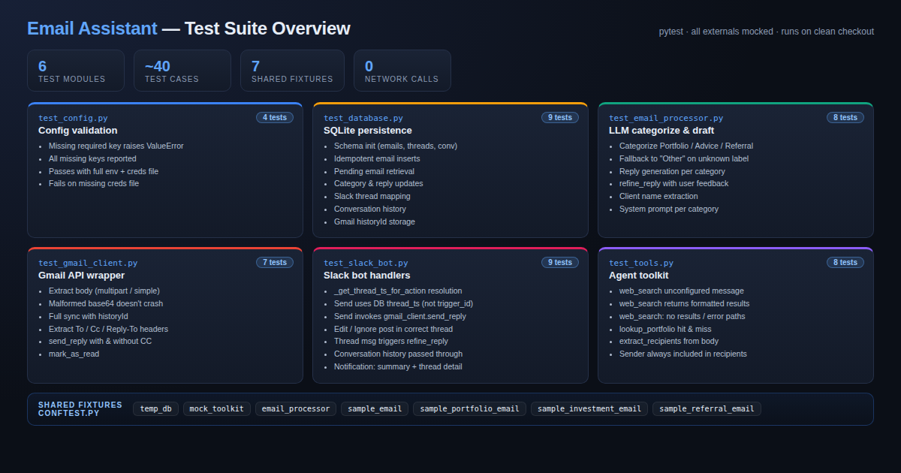

# Testing Guide



This document describes how the test suite for the email assistant is structured, what each test module covers, and how to run and extend the tests.

## Overview

The project uses [`pytest`](https://docs.pytest.org/) as its test runner. All tests live under the top-level `tests/` directory and exercise the modules in `src/`. The suite is designed to run without any real network calls, credentials, or external services — every external dependency (OpenAI, Gmail API, Slack, Tavily, Google Sheets) is mocked.

```
tests/
├── __init__.py
├── conftest.py                 # Shared pytest fixtures
├── test_config.py              # Environment / config validation
├── test_database.py            # SQLite persistence layer
├── test_email_processor.py     # LLM-based categorization and reply generation
├── test_gmail_client.py        # Gmail API wrapper
├── test_slack_bot.py           # Slack bot handlers and notifications
└── test_tools.py               # Agent toolkit (web search, portfolio lookup)
```

## Running the tests

From the repository root:

```bash
# Run the full suite
python3 -m pytest tests/ -v

# Run a single module
python3 -m pytest tests/test_slack_bot.py -v

# Run a single test function
python3 -m pytest tests/test_database.py::test_insert_email_idempotent -v

# Run with coverage
python3 -m pytest --cov=src tests/
```

The tests do not require any `.env` values, Google credentials, or running services. They can be executed on a clean checkout immediately after `pip install -r requirements.txt`.

## Fixtures (`tests/conftest.py`)

Shared fixtures are defined in `conftest.py` and are available to every test module automatically.

| Fixture | Scope | Purpose |
| --- | --- | --- |
| `temp_db` | function | Creates a real `Database` instance backed by a temporary SQLite file. The file is deleted after the test. Used anywhere the test needs real persistence semantics. |
| `mock_toolkit` | function | A `MagicMock` that mimics `ToolKit`, with canned return values for `web_search` and `lookup_portfolio`. |
| `email_processor` | function | An `EmailProcessor` with `openai.OpenAI` patched out and `.client` replaced by a `MagicMock`, so tests can stub chat completion responses. |
| `sample_email` | function | Minimal email dict used as the default input across modules. |
| `sample_portfolio_email` | function | Email styled as a portfolio update. |
| `sample_investment_email` | function | Email styled as an investment advice request. |
| `sample_referral_email` | function | Email styled as a client referral. |

Using a real temporary database (rather than mocking SQLite) keeps the database tests honest — they catch schema mistakes, bad SQL, and missing columns.

## Test modules

### `test_config.py`
Covers `src/config.py::Config.validate()`. Verifies that:
- Missing required environment values raise `ValueError` with the offending key name.
- Multiple missing keys are all reported.
- Validation passes when every required key is set **and** the Google credentials file exists on disk.
- Validation fails when the credentials file path does not exist.

The tests use `unittest.mock.patch.object` to temporarily swap `Config` class attributes instead of touching the real environment.

### `test_database.py`
Exercises `src/database.py::Database` through the `temp_db` fixture. Covers:
- Schema creation (`emails`, `slack_threads`, `conversations` tables exist after init).
- Idempotent inserts (`insert_email` returns the same id when called twice).
- Fetching pending emails.
- Updating category, suggested reply, and ignored status.
- Slack thread ↔ email mapping round-trip.
- Conversation history append/read.
- Gmail history-id storage for incremental sync.
- `recipients_json` serialization of To/Cc/Reply-To.

These tests run against a real SQLite file, so they also serve as regression tests for any schema migration.

### `test_email_processor.py`
Tests `src/email_processor.py::EmailProcessor`. The `email_processor` fixture replaces the OpenAI client with a mock, and each test stubs `client.chat.completions.create` to return a canned response. Covers:
- Categorization for each supported category (Portfolio Updates, Investment Advice, Referrals).
- Fallback to `"Other"` when the model returns an unknown label.
- Reply generation for different categories.
- `refine_reply` applying user feedback to an existing draft.
- `_extract_client_name` parsing from `Name <email@…>` and bare email addresses.
- `_get_system_prompt` returning category-appropriate prompt text.

No real OpenAI calls are made; the tests only assert on how the processor assembles inputs and interprets outputs.

### `test_gmail_client.py`
Tests `src/gmail_client.py::GmailClient`. A local fixture (`gmail_client`) patches `Path`, `OAuth2Credentials`, and `googleapiclient.discovery.build` so the client can be constructed without any credential files. The Gmail service is a `MagicMock` whose `.users().messages()...` chain is stubbed per test. Covers:
- `_extract_body` for multipart `text/plain`, simple inline body, and malformed base64 (should not raise).
- `get_new_emails` full-sync flow, including history-id retrieval via `getProfile`.
- `_get_message_details` extracting To, Cc, and Reply-To headers.
- `send_reply` with and without Cc.
- `mark_as_read`.

### `test_slack_bot.py`
Tests `src/slack_bot.py::SlackBot`. A module-level `mock_slack_app` fixture patches `slack_bolt.App` so decorators (`@app.action`, `@app.message`) become no-op passthroughs — this lets the bot register handlers without a real Slack connection. The bot is then constructed with the real `temp_db`, a mocked `EmailProcessor`, and a mocked `GmailClient`.

Covers:
- `_get_thread_ts_for_action` correctly resolving the Slack thread_ts from the DB, and returning `None` when no mapping exists.
- The Send button posts to the database-stored `thread_ts`, **not** to Slack's `trigger_id` (regression test for a real bug).
- The Send button invokes `gmail_client.send_reply`.
- The Edit button posts into the correct thread.
- The Ignore button both marks the email ignored in the DB and posts into the correct thread.
- Thread replies trigger `email_processor.refine_reply` and update the stored draft.
- Conversation history is passed through to `refine_reply` on follow-up refinements.
- `send_email_notification` posts a summary message plus a threaded detail message (two `chat_postMessage` calls), and returns the summary's `ts`.

### `test_tools.py`
Tests `src/tools.py::ToolKit`. Covers:
- `web_search` returning a helpful message when no Tavily API key is configured.
- `web_search` formatting results from a mocked `tavily.Client`.
- `web_search` handling zero results and exceptions gracefully.
- `lookup_portfolio` using a mocked `SheetsClient` for both hit and miss cases.
- `extract_recipients` pulling email addresses out of a body and always including the original sender.

## Conventions and patterns

- **Mock at the boundary.** External SDKs (OpenAI, Google API client, Slack Bolt, Tavily) are always patched; the code under test is real.
- **Use `temp_db` for persistence tests.** Do not mock SQLite — the real database is fast and catches schema drift.
- **Stub `chat.completions.create` per test.** Each LLM-dependent test sets its own `mock_response.choices[0].message.content` so assertions are explicit about what the model "said".
- **Assert on `call_args` / `call_args_list`.** Many Slack bot tests verify *how* methods were called (e.g. which `thread_ts` was used), not just return values.
- **Keep fixtures in `conftest.py`.** Test-specific fixtures (e.g. `mock_gmail_service`, `slack_bot`) live inside their own module.

## Adding new tests

1. If the new functionality touches persistence, reuse `temp_db` and the `sample_*` email fixtures.
2. If it calls an external API, patch the SDK entry point (e.g. `patch("src.gmail_client.build", ...)`).
3. For LLM behavior, patch the OpenAI client on `EmailProcessor` and stub the chat-completion response.
4. Prefer asserting on concrete call arguments over loose "was called" checks when the argument carries meaning (thread ids, recipients, etc.).
5. Run `python3 -m pytest tests/ -v` before committing.
